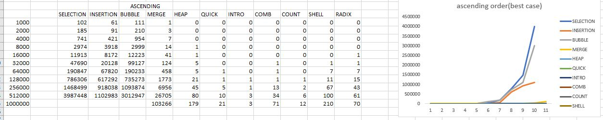

Implemented the following sorting algoithms on 3 files which had numbers sorted
in ascending, descending and random order. The various sorting technoques are:
1) Bubble sort
2) CombSort
3) Count Sort
4) Heap
5) Insertion
6) Isort
7) MergeSort
8) QuickSort
9)RadixSort
10) SelectionSort
11) Shell

The various sorting are analyzed and graphs are plotted in accordance with their runtimes

